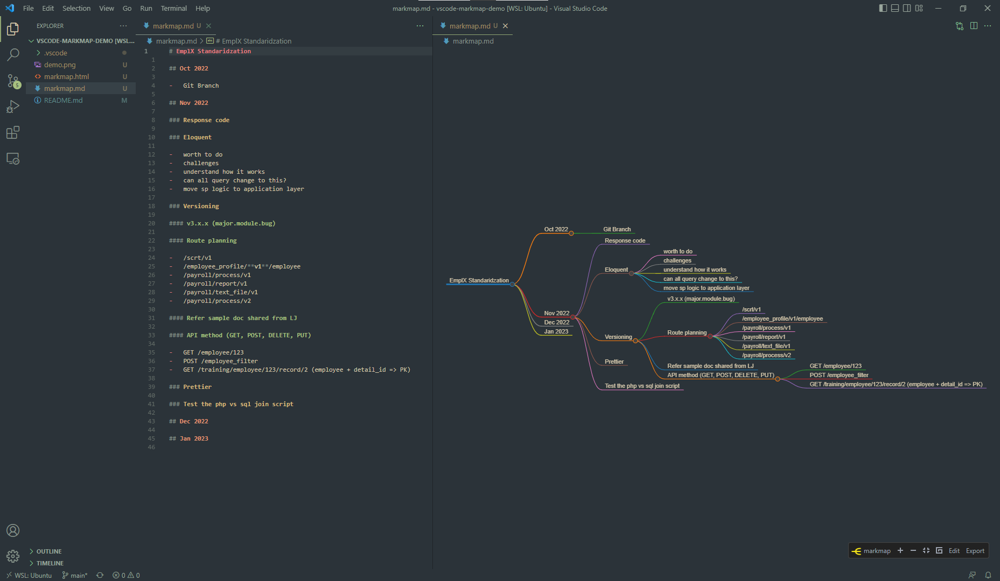

# vscode-markmap-demo

-   Powered by vscode
-   Install recommended vscode extension `gera2ld.markmap-vscode`. Read more about it [here](https://marketplace.visualstudio.com/items?itemName=gera2ld.markmap-vscode).

## Advantages

-   Pure markdown
-   Free
-   Work offline
-   Collapse node
-   Version control-able with Git
-   Colloborate via Git
-   Export and share

## Disadvantages

-   Quite packed to my liking

